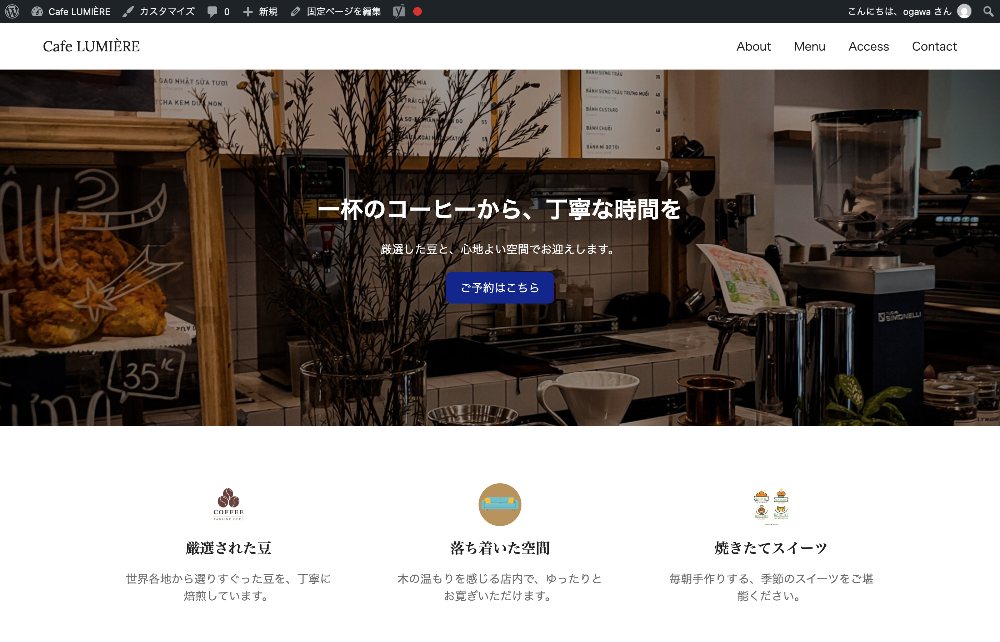
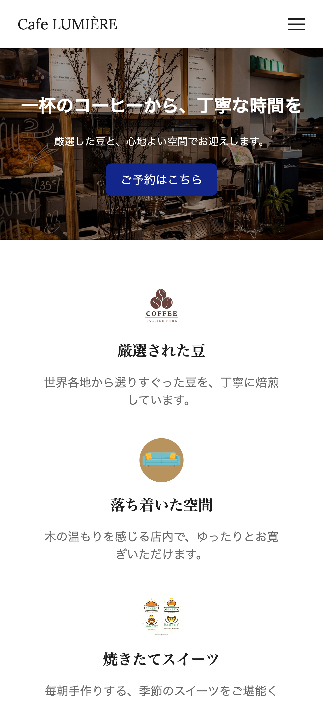

# Cafe LUMIÈRE Theme

架空のカフェサイト「Cafe LUMIÈRE」用のWordPressオリジナルテーマです。

## 公開URL

※本リポジトリ(`lumiere-theme`)はWordPressテーマのソースコードです。上記URLの静的公開用ファイルは`docs`フォルダで管理しています。

https://coda-webcraft.github.io/lumiere-theme/

## スクリーンショット

| PC | スマホ |
|---|---|
|  |  |

## 使用技術
- WordPress(オリジナルテーマ、ノーコードテーマ不使用)
- PHP(WordPressテンプレート階層に沿った実装)
- Advanced Custom Fields(ACF)
- CSS(プレーンCSS。クラス命名はBEM風の考え方を意識)
- Contact Form 7
- Yoast SEO

## 主な機能
- ACFによるトップページ各セクションの編集(ヒーロー・こだわり・アクセス・お問い合わせ 等)
- カスタム投稿タイプ「メニュー」「お客様の声」「FAQ」「休業日カレンダー」
- カスタムタクソノミー「メニューカテゴリー」によるメニューの絞り込み表示
- ブログ機能(サイドバー・一覧・詳細ページ、カテゴリー別テンプレート)
- Googleマップ埋め込み、パンくずリスト(Yoast SEO連携)
- お問い合わせフォーム(Contact Form 7)
- 独自実装の営業カレンダー(休業日を色分け表示)

## ディレクトリ構成

```
lumiere-theme/
├── docs/                     # GitHub Pages公開用(静的サイト)
├── inc/
│   └── acf-fields.php        # ACFフィールド定義
├── js/
│   └── main.js
├── screenshots/               # README用スクリーンショット
├── 404.php
├── archive-menu_item.php     # メニュー投稿タイプの一覧
├── category.php
├── footer.php
├── front-page.php            # トップページ
├── functions.php
├── header.php
├── home.php                  # ブログ一覧
├── index.php
├── page.php
├── sidebar.php
├── single.php                # ブログ記事詳細
├── style.css
├── taxonomy-menu_category.php # メニューカテゴリー別一覧
└── README.md
```

## 今後の展望
- SCSS導入によるスタイル管理の効率化
- 個別ページテンプレートの拡充
